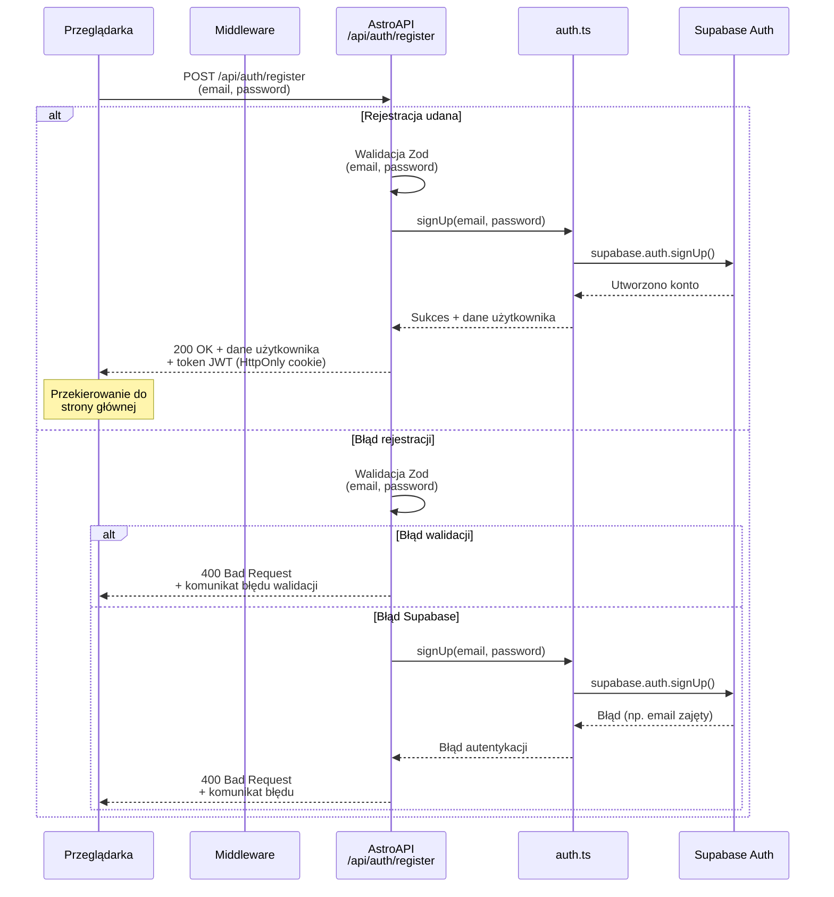
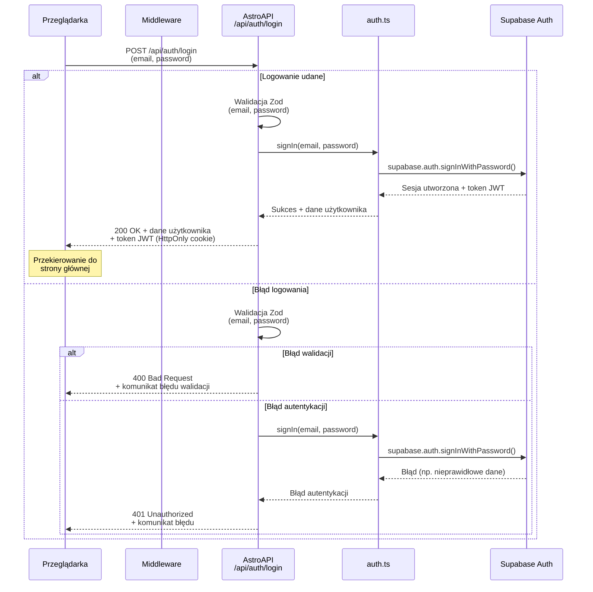
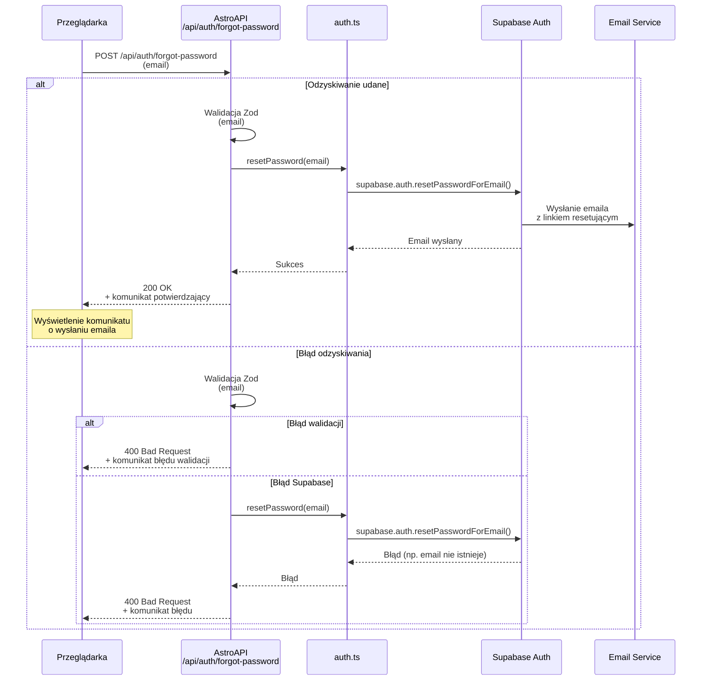
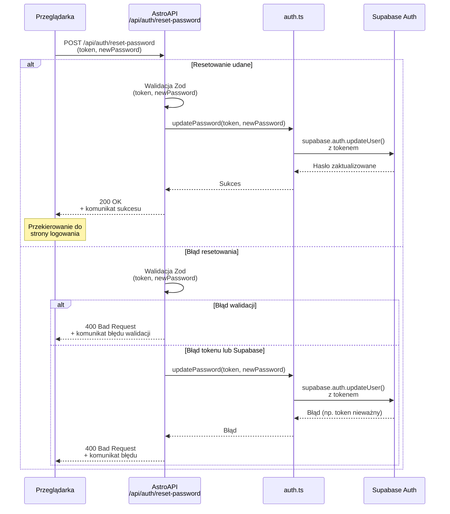
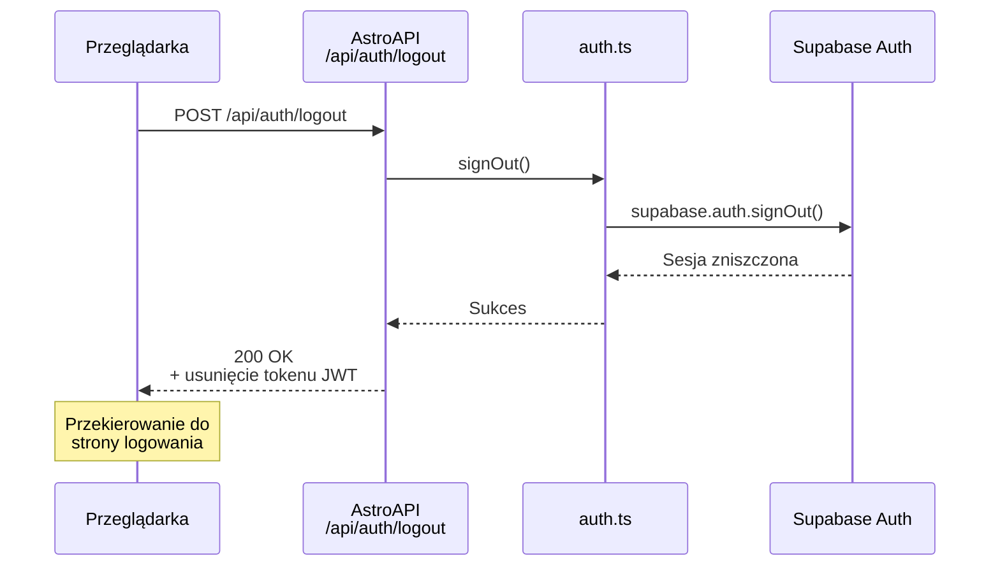
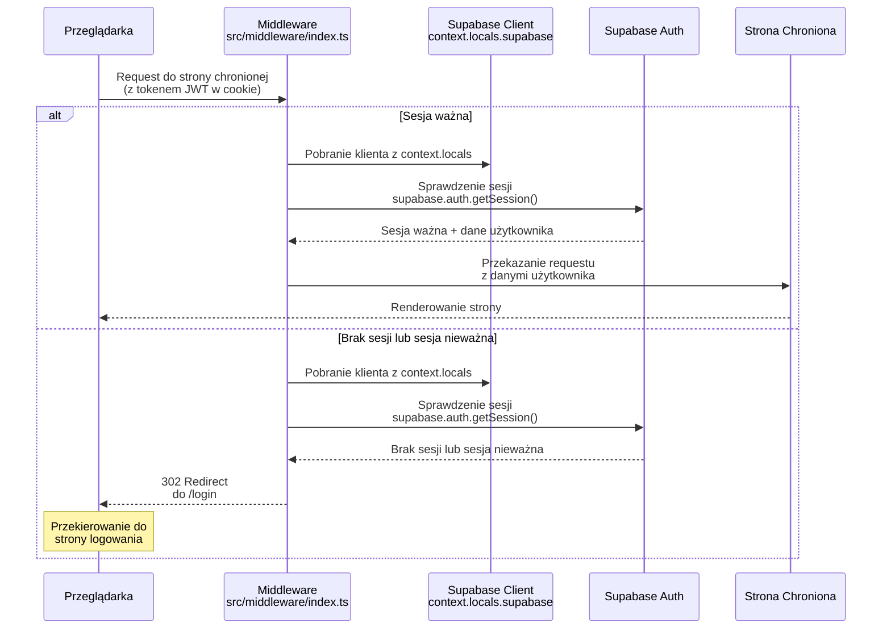

# Diagram Sekwencji Autentykacji - Flashcards Project

<architecture_analysis>
## Analiza architektury modułu autentykacji

### Komponenty wymienione w dokumentacji:

1. **Strony Publiczne (Astro)**:
   - `register.astro` - strona rejestracji z komponentem React `RegisterForm`
   - `login.astro` - strona logowania z komponentem React `LoginForm`
   - `forgot-password.astro` - strona odzyskiwania hasła z komponentem React `PasswordRecoveryForm`
   - `reset-password.astro` - strona resetowania hasła z komponentem React `ResetPasswordForm`

2. **Strony Autoryzowane (Astro)**:
   - `AuthLayout.astro` - layout dla stron chronionych z nawigacją
   - Strony aplikacji używające AuthLayout (np. `generate.astro`, `index.astro`)

3. **Komponenty React (Client-side)**:
   - `RegisterForm` - formularz rejestracji z walidacją klient-side
   - `LoginForm` - formularz logowania z walidacją klient-side
   - `PasswordRecoveryForm` - formularz odzyskiwania hasła
   - `ResetPasswordForm` - formularz resetowania hasła z tokenem

4. **Endpointy API (Astro)**:
   - `POST /api/auth/register` - rejestracja użytkownika
   - `POST /api/auth/login` - logowanie użytkownika
   - `POST /api/auth/logout` - wylogowanie użytkownika
   - `POST /api/auth/forgot-password` - inicjacja odzyskiwania hasła
   - `POST /api/auth/reset-password` - resetowanie hasła z tokenem

5. **Middleware**:
   - `src/middleware/index.ts` - sprawdzanie sesji i przekierowywanie niezalogowanych użytkowników

6. **Serwisy i Biblioteki**:
   - `src/lib/auth.ts` - warstwa abstrakcji dla operacji autentykacyjnych
   - `src/db/supabase.client.ts` - klient Supabase
   - Supabase Auth - metody: signUp, signIn, signOut, resetPassword
   - Zod - walidacja danych wejściowych

### Przepływ danych:

1. **Rejestracja**:
   - Użytkownik wypełnia RegisterForm → walidacja klient-side → POST /api/auth/register → walidacja Zod → auth.ts → Supabase Auth signUp → utworzenie sesji → przekierowanie

2. **Logowanie**:
   - Użytkownik wypełnia LoginForm → walidacja klient-side → POST /api/auth/login → walidacja Zod → auth.ts → Supabase Auth signIn → utworzenie sesji JWT → przekierowanie

3. **Odzyskiwanie hasła**:
   - Użytkownik wypełnia PasswordRecoveryForm → POST /api/auth/forgot-password → walidacja Zod → auth.ts → Supabase Auth resetPassword → wysłanie emaila

4. **Resetowanie hasła**:
   - Użytkownik klika link z emaila → reset-password.astro → ResetPasswordForm → POST /api/auth/reset-password → walidacja tokenu i hasła → auth.ts → Supabase Auth → aktualizacja hasła

5. **Dostęp do stron chronionych**:
   - Request → Middleware sprawdza sesję → jeśli brak sesji → przekierowanie do login → jeśli sesja OK → dostęp do strony

### Funkcjonalności komponentów:

- **RegisterForm**: Walidacja email i hasła, potwierdzenie hasła, wyświetlanie błędów, komunikacja z API
- **LoginForm**: Walidacja email i hasła, wyświetlanie błędów logowania, komunikacja z API
- **PasswordRecoveryForm**: Walidacja email, wysłanie żądania resetu
- **ResetPasswordForm**: Walidacja tokenu i nowego hasła, aktualizacja hasła
- **AuthLayout**: Nawigacja, sprawdzanie stanu sesji, dostęp do funkcjonalności aplikacji
- **Middleware**: Sprawdzanie tokenu JWT, przekierowywanie niezalogowanych, dodawanie supabase client do context.locals
- **API Endpoints**: Walidacja Zod, integracja z auth.ts, obsługa błędów, zwracanie odpowiednich kodów HTTP
- **auth.ts**: Abstrakcja nad Supabase Auth, obsługa sesji, tokenów JWT
</architecture_analysis>

## Diagram Sekwencji - Rejestracja

## Diagram Sekwencji - Logowanie

## Diagram Sekwencji - Odzyskiwanie Hasła

## Diagram Sekwencji - Resetowanie Hasła

## Diagram Sekwencji - Wylogowanie

## Diagram Sekwencji - Sprawdzanie Sesji przez Middleware

