# Diagram Podróży Użytkownika - Autentykacja Flashcards Project

<user_journey_analysis>
## Analiza podróży użytkownika

### Ścieżki użytkownika wymienione w dokumentacji:

1. **Rejestracja konta (US-001)**:
   - Użytkownik wchodzi na stronę rejestracji
   - Wypełnia formularz (email, hasło)
   - Walidacja danych
   - Utworzenie konta
   - Automatyczne logowanie po rejestracji
   - Przekierowanie do widoku generowania fiszek

2. **Logowanie (US-002)**:
   - Użytkownik wchodzi na stronę logowania
   - Wypełnia formularz (email, hasło)
   - Walidacja danych
   - Weryfikacja poświadczeń
   - Utworzenie sesji
   - Przekierowanie do widoku generowania fiszek

3. **Odzyskiwanie hasła**:
   - Użytkownik wchodzi na stronę odzyskiwania hasła
   - Wprowadza email
   - Wysłanie emaila z linkiem resetującym
   - Otrzymanie emaila
   - Kliknięcie linku

4. **Resetowanie hasła**:
   - Użytkownik wchodzi na stronę resetowania hasła (z tokenem)
   - Wprowadza nowe hasło
   - Walidacja hasła
   - Aktualizacja hasła
   - Przekierowanie do logowania

5. **Dostęp do funkcjonalności (US-003, US-004, US-005, US-006, US-007, US-008)**:
   - Generowanie fiszek przez AI
   - Przegląd i zatwierdzanie fiszek
   - Edycja fiszek
   - Usuwanie fiszek
   - Ręczne tworzenie fiszek
   - Sesja nauki z algorytmem powtórek

6. **Wylogowanie**:
   - Użytkownik klika przycisk wylogowania
   - Przekierowanie do strony logowania

### Stan zalogowany vs niezalogowany - ekrany:

1. **Stan: Niezalogowany**
   - Strona główna (przekierowanie do /generate lub /login)
   - Strona logowania
   - Strona rejestracji
   - Strona odzyskiwania hasła
   - Strona resetowania hasła

2. **Stan: Zalogowany**
   - Widok generowania fiszek
   - Widok listy fiszek (Moje fiszki)
   - Widok sesji nauki
   - Edycja fiszek

### Punkty decyzyjne i alternatywne ścieżki:

1. **Punkt decyzyjny: Rejestracja**
   - Sukces → automatyczne logowanie → widok generowania
   - Błąd walidacji → pozostanie na stronie rejestracji z komunikatem
   - Błąd (email zajęty) → pozostanie na stronie rejestracji z komunikatem

2. **Punkt decyzyjny: Logowanie**
   - Sukces → utworzenie sesji → widok generowania
   - Błąd walidacji → pozostanie na stronie logowania z komunikatem
   - Błąd autentykacji → pozostanie na stronie logowania z komunikatem

3. **Punkt decyzyjny: Dostęp do strony chronionej**
   - Sesja ważna → dostęp do strony
   - Brak sesji → przekierowanie do logowania

4. **Punkt decyzyjny: Resetowanie hasła**
   - Token ważny → możliwość resetu
   - Token nieważny → błąd

### Opis celu każdego stanu:

- **StronaGłówna**: Punkt wejścia do aplikacji, przekierowanie do odpowiedniej strony
- **StronaLogowania**: Umożliwienie zalogowania się do aplikacji
- **StronaRejestracji**: Utworzenie nowego konta użytkownika
- **StronaOdzyskiwaniaHasła**: Inicjacja procesu odzyskiwania hasła
- **StronaResetowaniaHasła**: Ustawienie nowego hasła przy użyciu tokenu
- **WidokGenerowaniaFiszek**: Główna funkcjonalność - generowanie fiszek przez AI
- **WidokMojeFiszki**: Przegląd, edycja i zarządzanie fiszkami
- **WidokSesjiNauki**: Nauka z wykorzystaniem algorytmu spaced repetition
- **EdycjaFiszki**: Modyfikacja treści fiszki
</user_journey_analysis>

## Diagram Podróży Użytkownika

```mermaid
stateDiagram-v2
    [*] --> StronaGlowna

    state "Stany Niezalogowanego Użytkownika" as Niezalogowany {
        StronaGlowna
        StronaLogowania
        StronaRejestracji
        StronaOdzyskiwaniaHasla
        StronaResetowaniaHasla
        
        state "Proces Rejestracji" as Rejestracja {
            FormularzRejestracji
            WalidacjaDanych
            if_rejestracja <<choice>>
            UtworzenieKonta
            if_utworzenie <<choice>>
            AutomatyczneLogowanie
            
            FormularzRejestracji --> WalidacjaDanych: Wypełnienie formularza
            WalidacjaDanych --> if_rejestracja
            if_rejestracja --> UtworzenieKonta: Dane poprawne
            if_rejestracja --> FormularzRejestracji: Błąd walidacji
            UtworzenieKonta --> if_utworzenie
            if_utworzenie --> AutomatyczneLogowanie: Konto utworzone
            if_utworzenie --> FormularzRejestracji: Błąd email zajęty
        }
        
        state "Proces Logowania" as Logowanie {
            FormularzLogowania
            WalidacjaDanychLogowania
            if_logowanie <<choice>>
            WeryfikacjaPoświadczeń
            if_weryfikacja <<choice>>
            UtworzenieSesji
            
            FormularzLogowania --> WalidacjaDanychLogowania: Wypełnienie formularza
            WalidacjaDanychLogowania --> if_logowanie
            if_logowanie --> WeryfikacjaPoświadczeń: Dane poprawne
            if_logowanie --> FormularzLogowania: Błąd walidacji
            WeryfikacjaPoświadczeń --> if_weryfikacja
            if_weryfikacja --> UtworzenieSesji: Poświadczenia poprawne
            if_weryfikacja --> FormularzLogowania: Nieprawidłowe dane
        }
        
        state "Proces Odzyskiwania Hasła" as OdzyskiwanieHasla {
            FormularzOdzyskiwania
            WyslanieEmaila
            OczekiwanieNaEmail
            
            FormularzOdzyskiwania --> WyslanieEmaila: Wprowadzenie emaila
            WyslanieEmaila --> OczekiwanieNaEmail: Email wysłany
        }
        
        state "Proces Resetowania Hasła" as ResetowanieHasla {
            FormularzResetowania
            WalidacjaTokenu
            if_token <<choice>>
            AktualizacjaHasla
            HasloZaktualizowane
            
            FormularzResetowania --> WalidacjaTokenu: Wprowadzenie hasła
            WalidacjaTokenu --> if_token
            if_token --> AktualizacjaHasla: Token ważny
            if_token --> FormularzResetowania: Token nieważny
            AktualizacjaHasla --> HasloZaktualizowane: Sukces
        }
        
        StronaGlowna --> StronaLogowania: Kliknięcie Zaloguj się
        StronaGlowna --> StronaRejestracji: Kliknięcie Zarejestruj się
        StronaRejestracji --> Rejestracja: Rozpoczęcie rejestracji
        Rejestracja --> AutomatyczneLogowanie: Konto utworzone
        AutomatyczneLogowanie --> UtworzenieSesji: Automatyczne logowanie
        StronaLogowania --> Logowanie: Rozpoczęcie logowania
        StronaLogowania --> StronaOdzyskiwaniaHasla: Zapomniałem hasła
        Logowanie --> UtworzenieSesji: Utworzenie sesji
        StronaOdzyskiwaniaHasla --> OdzyskiwanieHasla: Rozpoczęcie odzyskiwania
        OdzyskiwanieHasla --> StronaResetowaniaHasla: Link z emaila
        StronaResetowaniaHasla --> ResetowanieHasla: Rozpoczęcie resetowania
        ResetowanieHasla --> StronaLogowania: Hasło zaktualizowane
    }

    state "Stany Zalogowanego Użytkownika" as Zalogowany {
        WidokGenerowaniaFiszek
        WidokMojeFiszki
        WidokSesjiNauki
        Wylogowanie
        
        state "Widok Generowania Fiszek" as Generowanie {
            FormularzTekstu
            WalidacjaTekstu
            if_tekst <<choice>>
            GenerowanieFiszek
            ListaPropozycji
            PrzegladPropozycji
            if_akceptacja <<choice>>
            ZapisFiszek
            EdycjaFiszki
            OdrzucenieFiszki
            
            FormularzTekstu --> WalidacjaTekstu: Wprowadzenie tekstu
            WalidacjaTekstu --> if_tekst
            if_tekst --> GenerowanieFiszek: Tekst poprawny
            if_tekst --> FormularzTekstu: Tekst niepoprawny
            GenerowanieFiszek --> ListaPropozycji: Fiszki wygenerowane
            ListaPropozycji --> PrzegladPropozycji: Wyświetlenie propozycji
            PrzegladPropozycji --> if_akceptacja
            if_akceptacja --> ZapisFiszek: Zaakceptowanie
            if_akceptacja --> EdycjaFiszki: Edycja
            if_akceptacja --> OdrzucenieFiszki: Odrzucenie
            ZapisFiszek --> FormularzTekstu: Fiszki zapisane
            EdycjaFiszki --> ZapisFiszek: Zapis po edycji
            OdrzucenieFiszki --> PrzegladPropozycji: Powrót
        }
        
        state "Widok Moje Fiszki" as MojeFiszki {
            ListaFiszek
            if_akcja <<choice>>
            EdycjaFiszki
            UsuniecieFiszki
            PotwierdzenieUsuniecia
            NowaFiszka
            FormularzNowejFiszki
            ZapisNowejFiszki
            ZapisZmian
            
            ListaFiszek --> if_akcja
            if_akcja --> EdycjaFiszki: Kliknięcie Edytuj
            if_akcja --> UsuniecieFiszki: Kliknięcie Usuń
            if_akcja --> NowaFiszka: Kliknięcie Dodaj
            EdycjaFiszki --> ZapisZmian: Zapis zmian
            UsuniecieFiszki --> PotwierdzenieUsuniecia: Potwierdzenie
            PotwierdzenieUsuniecia --> ListaFiszek: Fiszka usunięta
            NowaFiszka --> FormularzNowejFiszki: Formularz
            FormularzNowejFiszki --> ZapisNowejFiszki: Zapis
            ZapisNowejFiszki --> ListaFiszek: Fiszka dodana
            ZapisZmian --> ListaFiszek: Zmiany zapisane
        }
        
        state "Widok Sesji Nauki" as SesjaNauki {
            PrzygotowanieSesji
            WyswietleniePrzodu
            WyswietlenieTylu
            OcenaFiszki
            if_koniec <<choice>>
            ZakonczenieSesji
            
            PrzygotowanieSesji --> WyswietleniePrzodu: Algorytm przygotował
            WyswietleniePrzodu --> WyswietlenieTylu: Pokaż odpowiedź
            WyswietlenieTylu --> OcenaFiszki: Ocena przyswojenia
            OcenaFiszki --> if_koniec
            if_koniec --> WyswietleniePrzodu: Kolejna fiszka
            if_koniec --> ZakonczenieSesji: Koniec sesji
        }
        
        WidokGenerowaniaFiszek --> Generowanie: Rozpoczęcie generowania
        WidokGenerowaniaFiszek --> WidokMojeFiszki: Przejście do Moje fiszki
        WidokGenerowaniaFiszek --> WidokSesjiNauki: Przejście do Sesji nauki
        WidokGenerowaniaFiszek --> Wylogowanie: Kliknięcie Wyloguj
        Generowanie --> WidokGenerowaniaFiszek: Powrót
        
        WidokMojeFiszki --> MojeFiszki: Zarządzanie fiszkami
        MojeFiszki --> WidokGenerowaniaFiszek: Powrót
        
        WidokSesjiNauki --> SesjaNauki: Rozpoczęcie sesji
        SesjaNauki --> WidokGenerowaniaFiszek: Zakończenie sesji
    }

    Niezalogowany --> Zalogowany: Utworzenie sesji
    Zalogowany --> Niezalogowany: Wylogowanie
    Wylogowanie --> StronaLogowania: Sesja zniszczona
    UtworzenieSesji --> WidokGenerowaniaFiszek: Przekierowanie

    note right of StronaLogowania
        Formularz zawiera pola email i hasło
        oraz link do odzyskiwania hasła
    end note

    note right of StronaRejestracji
        Formularz zawiera pola email, hasło
        i potwierdzenie hasła
    end note

    note right of WidokGenerowaniaFiszek
        Główny widok aplikacji dostępny
        po zalogowaniu
    end note
```



aniu
    end note
```

